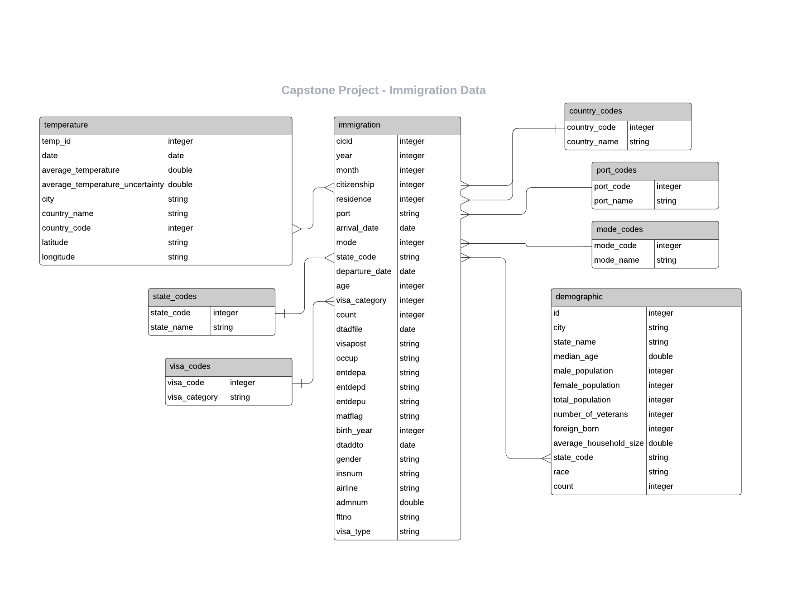

# Capstone Project
## Project Structure
```
    .ProjectWorkspace                           # main folder 
        ├── images                              # images
        │   └── erm.png
        ├── Capstone Project Development.ipynb  # used for etl development
        ├── etl_capstone.py                     # contains functions to read and clean data
        ├── etl_main.py                         # contains main funtion
        ├── I94_SAS_Labels_Descriptions.SAS     # contains the descriptions for immigration data
        ├── README.md                           # provides discussion on the project
        └── us-cities-demographics.csv          # contains demographic data
```

## Purpose of the Project
In this project the immigration data, demographic data, and temperature data are gathered for analytic purposes.
The goal is to prepare a database to analyze the immigration data if there are connections to demographics or to temperatures.

## Datasets
The following datasets are used in the project:

### I94 Immigration Data

This data comes from the US National Tourism and Trade Office. The file ```I94_SAS_Labels_Descriptions.SAS``` contains a data dictionary for the immigration data and is also parsed for the database. ```immigration_data_sample.csv``` comntains a sample file for the data in csv format.
https://travel.trade.gov/research/reports/i94/historical/2016.html

The data contains the following information:
* cicid
* i94yr - 4 digit year
* i94mon - Numeric month
* i94cit & i94res - country of citizenship & country of residence
    * This format shows all the valid and invalid codes for processing
* i94port - city with port
    * This format shows all the valid and invalid codes for processing
* arrdate - is the Arrival Date in the USA. It is a SAS date numeric field that a permament format has not been applied.
    * Please apply whichever date format works for you.
* i94mode - mode of transport
    * There are missing values as well as not reported (9)
* i94addr - State
    * There is lots of invalid codes in this variable and the list below shows what we have found to be valid, everything else goes into 'other'
* depdate - is the Departure Date from the USA. It is a SAS date numeric field that a permament format has not been applied.
    * Please apply whichever date format works for you.
* i94bir - Age of Respondent in Years
* i94visa - VISA categories
    * Visa codes collapsed into three categories
* count - Used for summary statistics
* dtadfile - Character Date Field
    * Date added to I-94 Files
    * CIC does not use
* visapost - Department of State where Visa was issued
    * CIC does not use
* occup - Occupation that will be performed in U.S.
    * CIC does not use
* entdepa - Arrival Flag
    * admitted or paroled into the U.S.
    * CIC does not use
* entdepd - Departure Flag
    * Departed, lost I-94 or is deceased
    * CIC does not use
* entdepu - Update Flag
    * Either apprehended, overstayed, adjusted to perm residence
    * CIC does not use
* matflag - Match flag
    * Match of arrival and departure records
* biryear - 4 digit year of birth
* dtaddto - Character Date Field
    * Date to which admitted to U.S. (allowed to stay until)
    * CIC does not use
* gender - Non-immigrant sex
* insnum - INS number
* airline - Airline used to arrive in U.S.
* admnum - Admission Number
* fltno - Flight number of Airline used to arrive in U.S.
* visatype - Class of admission legally admitting the non-immigrant to temporarily stay in U.S.

### World Temperature Data
This dataset came from Kaggle. You can read more about it here: https://www.kaggle.com/berkeleyearth/climate-change-earth-surface-temperature-data.

The data contains the following information:
* dt - Date
* AverageTemperature
* AverageTemperatureUncertainty
* City
* Country
* Latitude
* Longitude

### U.S. City Demographic Data
This data comes from OpenSoft. You can read more about it here: https://public.opendatasoft.com/explore/dataset/us-cities-demographics/export/.

The data contains the following information:
* City
* State
* Median Age
* Male Population
* Female Population
* Total Population
* Number of Veterans
* Foreign-born
* Average Household Size
* State Code
* Race
* Count

## Data Conversions and Cleanup

### Immigration Data
* remove null values
* cast double to integer
* convert string to date for date values
* change column labels

### World Temperature Data
* drop rows with missing values for: AverageTemperature, AverageTemperatureUncertainty
* remove duplicate rows
* change column names
* temperature data available until 2013-09-01

### Demographic Information Data
* drop rows with missing values for: Male Population, Female Population, Number of Veterans, Foreign-born, Average Household Size
* change column names
* remove duplicate rows


## Data Model


The data is read from different data sources, cleaned, and finally stored in parquet files for analytic purposes.

### Necessary steps to pipeline the data into the data model

- read label descriptions for immigration data
- data quality check for label descriptions
- save descriptions data to parquet files
- read and clean immigration data
- data quality check for immigration data
- save immigration data to parquet files
- read and clean demographic data
- data quality check for demograhic data
- save demographic data to parquet files
- read and clean world temperature data
- data quality check for temperature data
- join temperature data with country codes
- save temperature data to parquet files